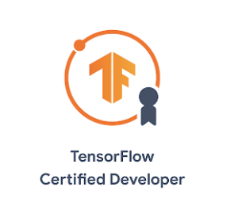

# TensorCertificate

Help you get prepared for TensorFlow Developer Certificate~

## 考点

建议结合notebook对照考点练习。太宽泛的考点如A.1我就直接划掉了。要考试必然要达成的条件如B.1我也就直接划掉了，帮大家减少干扰。
### A. TensorFlow developer skills

1. ~~Know how to program in Python, resolve Python issues, and compile and run Python programs in PyCharm.~~
1. ~~Know how to find information about TensorFlow APIs, including how to find guides and API references on tensorflow.org.~~
1. ~~Know how to debug, investigate, and solve error messages from the TensorFlow API.~~
1. ~~Know how to search beyond tensorflow.org, as and when necessary, to solve your TensorFlow questions.~~
1. ~~Know how to create ML models using TensorFlow where the model size is reasonable for the problem being solved.~~
1. ~~Know how to save ML models and check the model file size.~~
1. ~~Understand the compatibility discrepancies between different versions of TensorFlow.~~

### B. Building and training neural network models using TensorFlow 2.x

1. ~~Use TensorFlow 2.x.~~
1. ~~Build, compile and train machine learning (ML) models using TensorFlow.~~
1. Preprocess data to get it ready for use in a model.
1. ~~Use models to predict results.~~
1. ~~Build sequential models with multiple layers.~~
1. Build and train models for binary classification. 
1. Build and train models for multi-class categorization. [1](./notebooks/1.fully_connection_MNIST.ipynb)
1. ~~Plot loss and accuracy of a trained model.~~
1. Identify strategies to prevent overfitting, including augmentation and dropout. [1](./notebooks/1.fully_connection_MNIST.ipynb)
1. Use pretrained models (transfer learning).
1. Extract features from pre-trained models.
1. Ensure that inputs to a model are in the correct shape.
1. Ensure that you can match test data to the input shape of a neural network.
1. Ensure you can match output data of a neural network to specified input shape for test data.
1. Understand batch loading of data.
1. Use callbacks to trigger the end of training cycles.
1. Use datasets from different sources.
1. Use datasets in different formats, including json and csv.
1. Use datasets from tf.data.datasets.

### C. Image classification

1. Define Convolutional neural networks with Conv2D and pooling layers.
1. Build and train models to process real-world image datasets.
1. Understand how to use convolutions to improve your neural network.
1. Use real-world images in different shapes and sizes.
1. Use image augmentation to prevent overfitting.
1. Use ImageDataGenerator.
1. Understand how ImageDataGenerator labels images based on the directory structure.

### D. Natural language processing (NLP)

1. Build natural language processing systems using TensorFlow.
1. Prepare text to use in TensorFlow models.
1. Build models that identify the category of a piece of text using binary categorization
1. Build models that identify the category of a piece of text using multi-class categorization
1. Use word embeddings in your TensorFlow model.
1. Use LSTMs in your model to classify text for either binary or multi-class categorization.
1. Add RNN and GRU layers to your model.
1. Use RNNS, LSTMs, GRUs and CNNs in models that work with text.
1. Train LSTMs on existing text to generate text (such as songs and poetry)

### E. Time series, sequences and predictions

1. Train, tune and use time series, sequence and prediction models.
1. Prepare data for time series learning.
1. Understand Mean Average Error (MAE) and how it can be used to evaluate accuracy of sequence models.
1. Use RNNs and CNNs for time series, sequence and forecasting models.
1. Identify when to use trailing versus centred windows.
1. Use TensorFlow for forecasting.
1. Prepare features and labels.
1. Identify and compensate for sequence bias.
1. Adjust the learning rate dynamically in time series, sequence and prediction models.